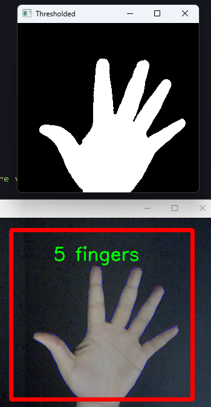
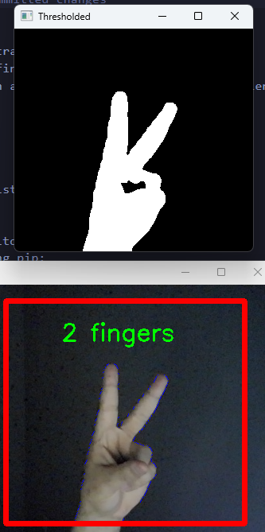
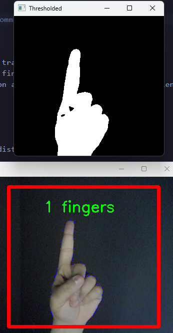

# Hand Tracker OpenCV

This project implements a hand tracking system using the OpenCV library in Python. The system is capable of detecting and counting the fingers of a hand in front of a camera in real-time.







## Features

- Real-time hand detection and tracking.
- Accurate counting of visible fingers on the detected hand.
- Visualization of the detection and counting process in a user-friendly graphical interface.

## Requirements

- Python 3.x
- OpenCV
- NumPy
- scikit-learn (for Euclidean distance calculation)

## Installation

1. Clone or download this repository.
2. Install the dependencies using pip:

   ```bash
    pip install opencv-python numpy scikit-learn
   ```

## Usage

1. Run the `hand_tracker.py` script.
2. Place your hand in front of the camera.
3. Watch as the system detects and counts fingers in real-time.

## Contributions

Contributions are welcome. If you want to improve this application, feel free to fork the repository, implement your changes, and send a pull request.

## License

This project is licensed under the [MIT License](LICENSE).
