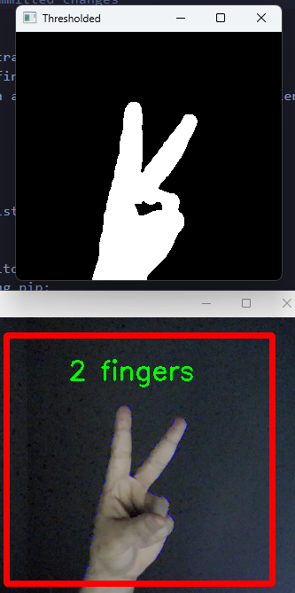

# Hand Tracker OpenCV

A computer vision project built in Python with OpenCV that performs real-time hand tracking through a webcam, detecting the hand and counting extended fingers frame by frame.

<p align="center">
  
  
</p>

## Features

- Real-time hand detection and tracking.
- Accurate counting of visible fingers on the detected hand.
- Visualization of the detection and counting process in a user-friendly graphical interface.

## Requirements

- Python 3.x
- OpenCV
- NumPy
- scikit-learn (for Euclidean distance calculation)

## Installation

1. Clone or download this repository.
2. Install the dependencies using pip:

   ```bash
    pip install opencv-python numpy scikit-learn
   ```

## Usage

1. Run the `hand_tracker.py` script.
2. Place your hand in front of the camera.
3. Watch as the system detects and counts fingers in real-time.

## Contributions

Contributions are welcome. If you want to improve this application, feel free to fork the repository, implement your changes, and send a pull request.

## License

This project is licensed under the [MIT License](LICENSE).
