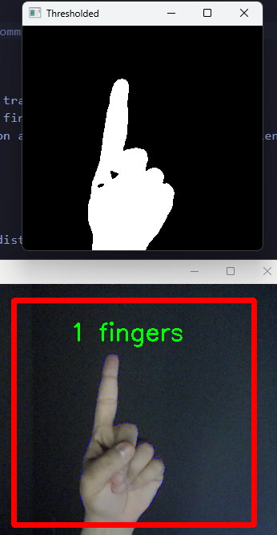
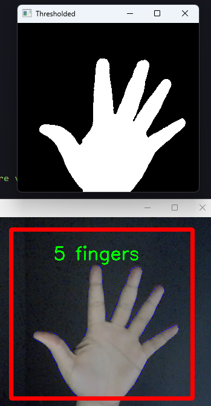

# Hand Tracker OpenCV

Real-time hand tracking and finger counting from a webcam, built with Python and OpenCV using classic computer-vision techniques (background subtraction, contours and convex hulls) — no deep learning models required.

<p align="center">
  
  
  
</p>

> **Status:** the working prototype lives in [`notebooks/hand-detection.ipynb`](notebooks/hand-detection.ipynb). It is being refactored into the `hand_tracker` Python package with a `hand-tracker` command; see the [Roadmap](#roadmap).

## Features

- Real-time hand detection inside a fixed region of interest (ROI).
- Counting of extended fingers, frame by frame.
- Live view with the hand contour and finger count, plus a thresholded (binary) view of the segmentation.

## How it works

1. **Background calibration.** For the first 60 frames the ROI is averaged (`cv2.accumulateWeighted`) to build a model of the empty background. Keep your hand out of the box during this step.
2. **Segmentation.** Each new frame is converted to grayscale, blurred and subtracted from the background. The difference is thresholded and the largest external contour is taken as the hand.
3. **Finger counting.** The convex hull of the hand gives its extreme points and center. A circle at about 90% of the maximum center-to-edge distance is intersected with the binary mask; each segment crossing that circle above the wrist counts as a finger.

## Project structure

```
hand-tracker-openCV/
├── assets/demo/            # Screenshots used in this README
├── notebooks/
│   └── hand-detection.ipynb  # Original working prototype
├── src/hand_tracker/       # Python package (work in progress)
│   ├── __main__.py         # `python -m hand_tracker`
│   ├── app.py              # Webcam loop and CLI entry point
│   ├── config.py           # Tunable parameters (camera, ROI, thresholds)
│   ├── background.py       # Background model
│   ├── segmentation.py     # Hand segmentation
│   └── fingers.py          # Finger counting
├── tests/                  # Unit tests (pytest)
├── pyproject.toml          # Metadata, dependencies and tool config
└── LICENSE
```

## Requirements

- Python 3.10+
- A webcam
- Dependencies: `opencv-python`, `numpy` (declared in [`pyproject.toml`](pyproject.toml))

## Installation

```bash
git clone https://github.com/emmanuelepp/hand-tracker-openCV.git
cd hand-tracker-openCV

python -m venv .venv
source .venv/bin/activate        # Windows: .venv\Scripts\activate

pip install -e ".[notebook]"     # run the notebook
pip install -e ".[dev]"          # development: pytest + ruff
```

## Usage

### Notebook (current)

```bash
jupyter notebook notebooks/hand-detection.ipynb
```

Run all cells. Two windows open: **Finger Count** (camera feed) and **Thresholded** (binary mask).

### Command line (in progress)

```bash
hand-tracker
# or
python -m hand_tracker
```

### Controls and tips

| Key | Action |
|-----|--------|
| `Esc` | Quit |

- Wait until the "WAIT. GETTING BACKGROUND" message disappears before putting your hand in the red box.
- Use a plain background that contrasts with your skin, and keep the camera and lighting steady.
- If the lighting changes, restart so the background is recalibrated.

## Limitations

- Requires a static camera and background; moving objects or lighting changes inside the ROI get detected as part of the hand.
- The hand must be inside the fixed ROI (top-right of the frame).
- Counting is heuristic: it can miscount if fingers are touching, if the thumb is tucked in, or if the wrist enters the ROI at an angle.

## Roadmap

- [ ] Move the notebook logic into the `hand_tracker` package with a `hand-tracker` CLI.
- [ ] Configurable camera, ROI and thresholds through command-line arguments.
- [ ] Fix contour drawing, clear stale results when no hand is visible, and correct the ROI variable definitions.
- [ ] Noise filtering (minimum contour area, morphological operations).
- [ ] Recalibrate the background at runtime (`r` key) and mirror the camera view.
- [ ] Remove the scikit-learn dependency (use NumPy for distances).
- [ ] Unit tests with synthetic hand masks.
- [ ] Alternative counting based on convexity defects.
- [ ] Optional MediaPipe Hands backend.

## Development

```bash
pytest          # run tests
ruff check .    # lint
ruff format .   # format
```

## Contributing

Contributions are welcome. Fork the repository, create a branch for your change, and open a pull request describing what it does and how you tested it.

## License

This project is licensed under the [MIT License](LICENSE).
